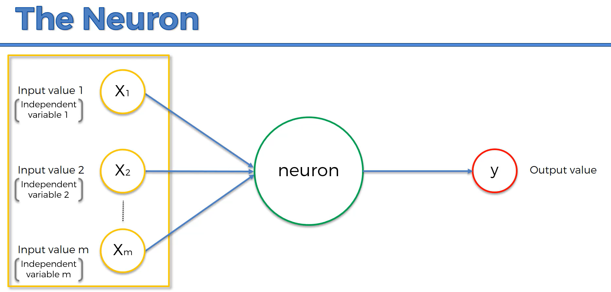
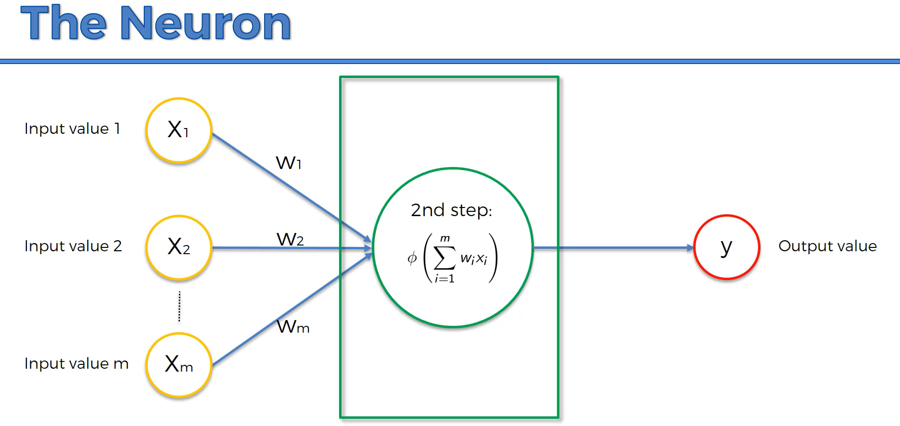
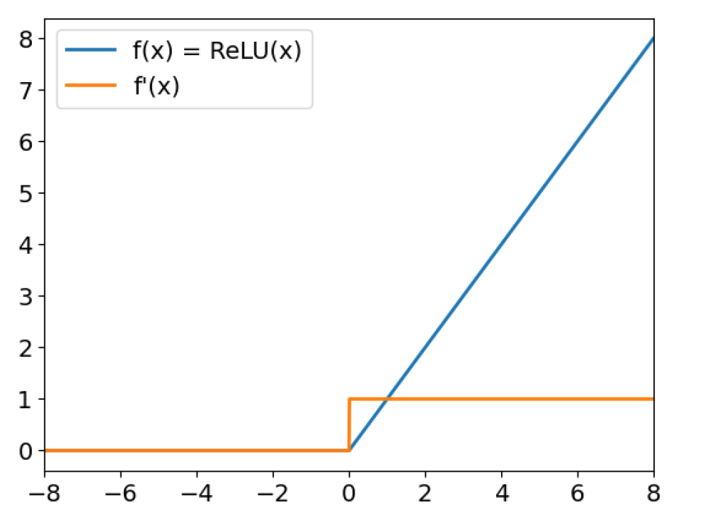
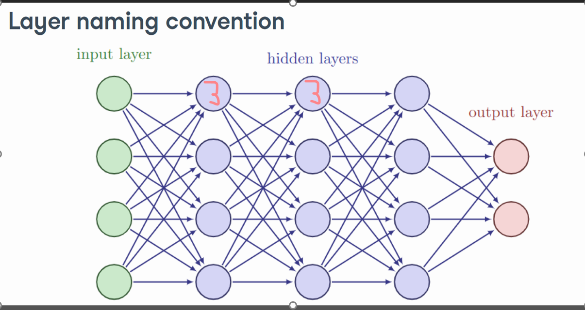
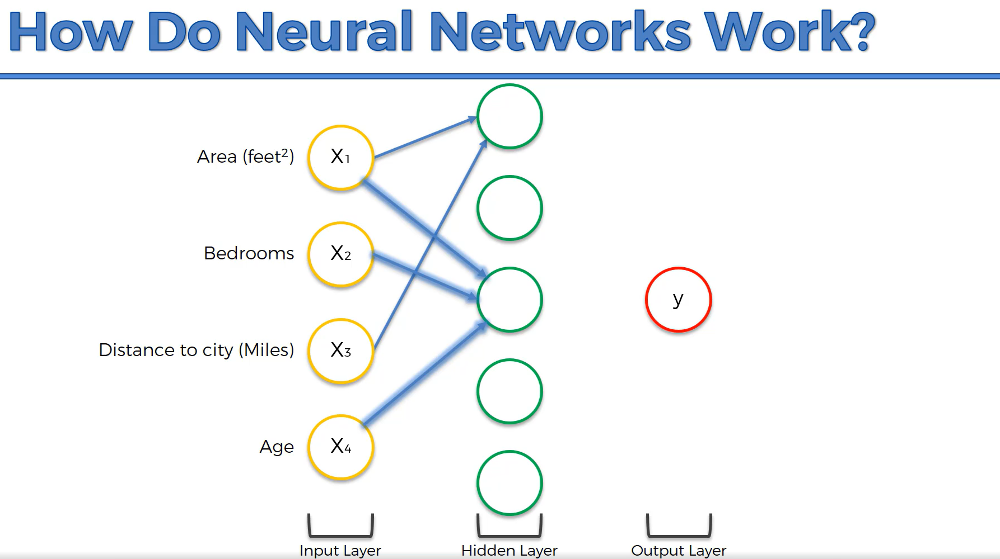
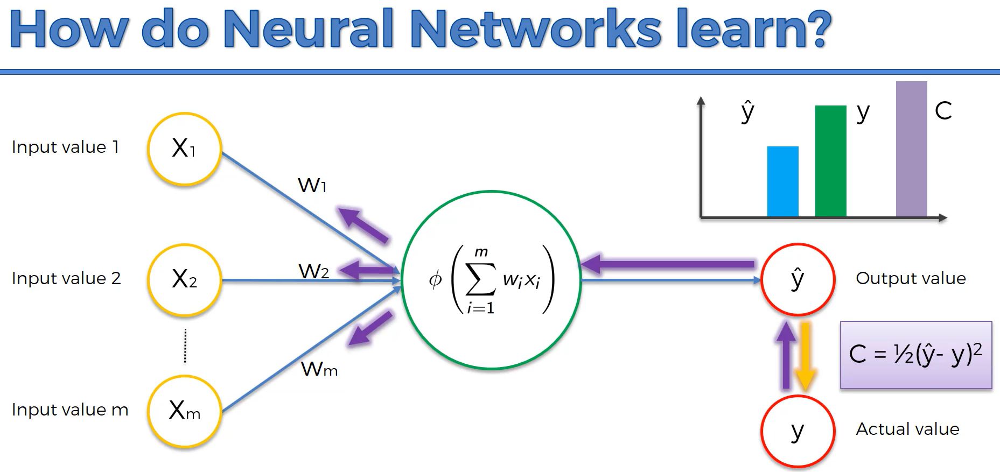
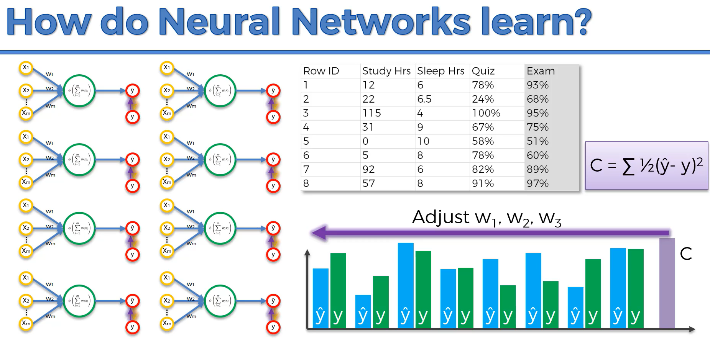

# The Neural Network Architecture

## Table of Contents
1. [The Neuron](#the-neuron)
2. [The Activation Function](#the-activation-function)
3. [Hidden Layers](#hidden-layers)

## The Neuron

**Neurons in a Neural Network:**
* Neurons are the basic units in a neural network that process information. They receive inputs (independent variables like Make, Model, Model_Year, Order_Record_Type), perform calculations based on the weights (this help the model learn), and pass the results to the next layer (a process known as backpropagation). Neurons help the model learn patterns and make predictions.
  * Make
  * Model
  * Model_Year
  * Order_Record_Type

### How Do Neurons Work?

#### Weighted Sum Calculation:

All the weights for each input neuron are used to compute the weighted sum of all the input values it’s getting. The weights are used to give the model the importance of each variable. This is represented mathematically as:
$$\text{Sum} = \sum_{i=1}^{m} w_i x_i$$
Here, \( w_i \) represents the weights, and \( x_i \) represents the input values.

#### Activation Function:

After calculating the weighted sum, the neuron applies an activation function to introduce non-linearity into the model. This helps the neural network learn more complex patterns.

$$
\phi\left(\sum_{i=1}^{m} w_i x_i\right)
$$

#### Example Diagram:

**Input values:** $x_{1}, x_{2}, \ldots, x_{m}$  
**Weights:** $w_{1}, w_{2}, \ldots, w_{m}$  
**(Optional) Bias:** $b$

**Weighted sum:** $z=\sum_{i=1}^{m} w_i x_i + b$  
**Output:** $\hat{y}=\phi(z)$

**Weighted Sum Calculation:**  
The neuron computes the sum of the input values multiplied by their corresponding weights.

**Output Value:**  
\(y\)  
- The final value after applying the activation function.

## The Activation Function
It applies a transformation to the weighted sum of inputs, introducing non-linearity into the model. This non-linearity allows the neural network to learn and represent more complex patterns and relationships in the data.

- **Threshold Function**
  - Historically used in perceptrons (basic binary classifiers)
  - Rarely used today due to its non-differentiability
  - Use Case: Binary classification (only when simplicity > learnability)

- **Sigmoid Function**
  - Output range: (0, 1)
  - Smooth gradient, but can cause vanishing gradients
  - Use Case:
    - ✅ Binary classification (as output layer activation)
    - ❌ Not recommended in hidden layers for deep models

- **Rectifier Function (ReLU)**
  - Output: $\max(0, x)$
  - Fast and efficient; avoids vanishing gradient for $x > 0$
  - Use Case:
    - ✅ Most hidden layers in deep networks
    - ❌ Not used in output layer directly
    - ❌ Not ideal for regression output unless customized (e.g., ReLU6)

- **Hyperbolic Tangent (tanh) Function**
  - Output range: (-1, 1); zero-centered
  - Steeper than sigmoid but can still suffer from vanishing gradients
  - Use Case:
    - ✅ Hidden layers (especially shallow nets)
    - ❌ Not typically used in output layer

- **Softmax Function** *(add if applicable)*
  - Converts raw scores to probability distribution
  - Use Case:
    - ✅ Multiclass classification (output layer)

### Rectifier Function

* **F(x) = max(x, 0)**
* The ReLU function outputs the input directly if it is positive; otherwise, it outputs zero.
* Graph: The function is zero for all negative inputs and linear with a slope of one for positive inputs.
* Benefits of ReLU:
  * Non-Linearity: Although it looks like a linear function, ReLU introduces non-linearity which helps the network learn complex patterns.
  * Simplicity: The function is computationally efficient, as it requires only a simple thresholding at zero.
  * Sparse Activation: It activates only a few neurons at a time, making the network sparse and efficient.
  * Mitigates Vanishing Gradient Problem: Unlike sigmoid and tanh, ReLU does not saturate for large positive values, helping in faster convergence.

#### Example:

Let's assume we have a neuron in the current layer:

- **Input values** are Make, Model, Model_Year, etc.
- **Weights** for this neuron are \( w_1, w_2, w_3 \), etc.
- **Calculate the weighted sum**:
  - Formula: 
  $$
  \text{Sum} = w_1 \cdot x_1 + w_2 \cdot x_2 + w_3 \cdot x_3 + \ldots
  $$
  - Let's say the weighted sum is 3.
- **Apply ReLU activation function**:
  - Formula: 
  $$
  f(x) = \max(0, x)
  $$
  $$
  f(3) = \max(3, 0) = 3
  $$
- This output (3) feeds into the neurons of the next layer, and the process continues. The 3 is used as \( x_1' \) in the formula to calculate the weighted sum for that specific neuron. This process is known as **Forward Propagation**, where the output of one layer serves as the input for the next layer. Once it reaches the end of the neural network, it computes a prediction which is shown in the neuron for the output layer.

#### Explanation:

1. **Input Layer**:
   - The green circles represent the input features such as Make, Model, Model_Year, etc.

2. **First Hidden Layer**:
   - Each neuron in the first hidden layer takes the inputs, calculates a weighted sum, and applies the ReLU activation function.
   - Example: One neuron outputs 3 after ReLU activation.

3. **Next Hidden Layer**:
   - The output value of 3 from the first hidden layer becomes one of the inputs to each neuron in the second hidden layer.
   - These neurons repeat the process: calculate a weighted sum using all their inputs (including the 3), apply ReLU, and pass the result to the next layer.

4. **Output Layer**:
   - The final layer takes the processed data and produces the final prediction or output of the network.

#### Summary:
- The value 3 is an example of how data flows through the network, getting transformed at each layer by weighted sums and activation functions.
- This process allows the network to learn and make predictions based on the input data.

## Hidden Layers
Hidden layers are the intermediate layers of a neural network situated between the input layer (which receives the raw input data) and the output layer (which produces the final prediction). They consist of neurons (nodes) that perform computations to transform the input into something the output layer can use.

**Functionality**
- Feature Extraction:
  - Hidden layers help in extracting relevant features from the input data through a process of weighted summation and activation functions.
- Non-Linearity:
  - They introduce non-linearity into the model by applying non-linear activation functions like ReLU, Sigmoid, or Tanh. This allows the network to learn complex patterns and representations in the data.
- Representation Learning:
  - Each layer can learn different representations of the data. For example, in image recognition, initial layers might detect edges and simple patterns, while deeper layers can recognize complex structures like faces or objects.

**Key Point**
* This is a great demonstration of forward propagation and how the ReLU function is applied with a value that is either positive or defaults to 0. If it defaults to 0, it essentially disconnects that connection between the neurons because those two features together are not important. That's key because we see that exact example happening here. The three neurons of Area, Bedrooms, and Age are the only neurons pointing to the third neuron in the hidden layer, creating a powerful feature that is a combination of these inputs.

# How Neural Networks Learn: Back Propagation

- Once the forward propogation is complete, we get Y hat, which represents our prediction for that row of data.
- We then take that prediction and feed it into a "Cost Function" (Yellow Arrow) and that helps compute the prediction error.
- Now we take that prediction error information and feed it back into our neural network (purple arrow) and it goes to our weights and the weights get updated based on that new information, and this process continues over and over until we reached the lowest prediction error.

This process is continued over and over for each row within our data. Then we compute the **cost function** using all of our predictions vs. actual and then update all of our weights. This example represents what our training process would look like with 8 rows of data. Once you've reached the smallest cost function the process stops because you now have found the optimal weights for your entire neural network.

